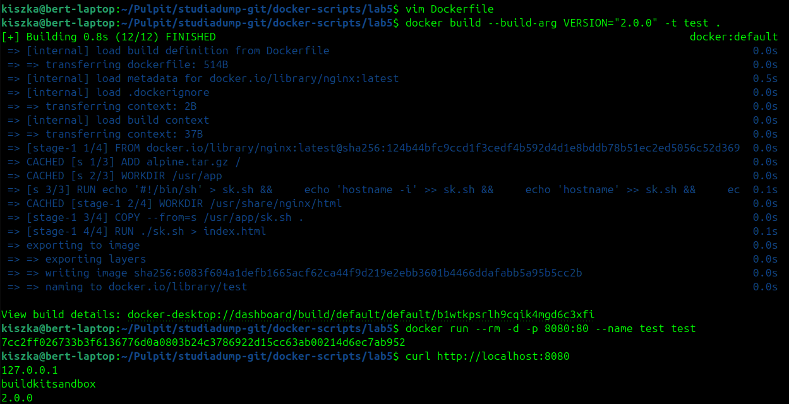

# Instrukcja uruchomienia kontenera
## Budowanie obrazu
Aby zbudowac kontener nalezy uzyc tej komendy::
```sh
docker build --build-arg VERSION="<numer_wersji>" -t <nazwa_obrazu> .
```
## Uruchamianie kontenera
Aby uruchomic kontener nalezy uzyc tej komendy:
```sh
docker run --rm -d -p 8080:80 --name <nazwa_kontenera> <nazwa_obrazu>
```
## Testowanie działania kontenera
Aby przetestowac dzialanie kontenera nalezy uzyc tej komendy:
```sh
curl http://localhost:8080
```

